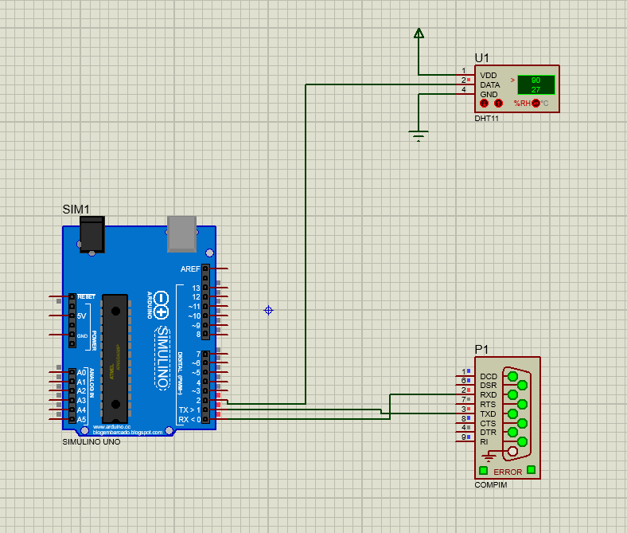
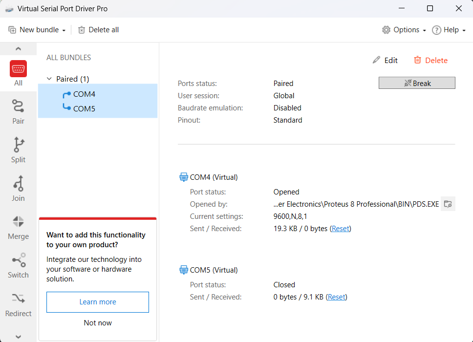

# Smart Farming IOT Sensor Microservice

## Proteus Connection
```markdown
Create a proteus simulation sheet, and add the following components:
1. Arduino UNO
2. DHT11
3. COMPIM



## Virtual Serial Port Driver
```markdown
Create a pair between COM4 and COM5, and create a virtual connection



## API 
```markdown
#### Get Sensor Data
Resquest:
```http
http://localhost:8081/get-sensor-data
```
#### Get Sensor Data
Response:
```http
http://localhost:8081/get-sensor-data
```